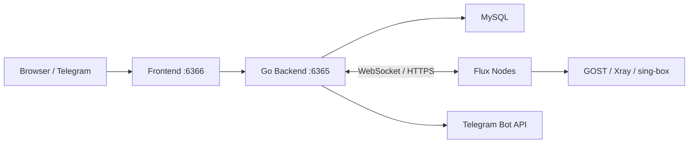

# Flux Panel Plus

[](https://github.com/kukumi1/flux-panel-plus/actions/workflows/ci.yml)
[](https://github.com/kukumi1/flux-panel-plus/actions/workflows/publish.yml)
[](https://github.com/kukumi1/flux-panel-plus/releases)
[](LICENSE)

Flux Panel Plus 是基于 [0xNetuser/flux-panel](https://github.com/0xNetuser/flux-panel) 二次开发的流量转发与代理管理面板。它保留原项目的节点、隧道、转发、用户及 Xray 管理能力，并增加多跳路由、连接审计、节点自更新、HA/DDNS 故障转移和 Telegram 手机控制台。

> 当前版本：`2.1.28-plus.1`。支持 Linux `amd64` / `arm64`，推荐使用 Docker Compose 部署。

## 主要功能

| 模块 | 能力 |
|---|---|
| 节点管理 | 在线状态、资源监控、远程安装、Docker/裸机节点、自更新与健康状态 |
| 隧道管理 | 单节点端口转发、双节点隧道、协议选择、链路诊断、流量倍率 |
| 转发管理 | TCP/UDP 转发、启停、负载策略、多目标、链路诊断、端口范围 |
| 多跳路由 | 多节点转发链路、逐跳端口协调、自动 reconcile 与故障诊断 |
| 流量审计 | 跨节点连接记录、来源/目标/协议/流量/时长、节点与转发筛选 |
| HA / DDNS | 节点组、健康检查、自动切换、Cloudflare 与 Webhook DDNS |
| Xray | 入站、客户端、订阅、证书及节点运行状态管理 |
| Telegram | 隧道、转发、节点、审计、账号用量及管理员操作的手机控制台 |

### Telegram Plus 功能

- Inline Keyboard 手机控制台与 22 个机器人命令。
- 在 Telegram 内新增隧道和转发，不只是查看。
- 隧道/转发诊断后台执行，操作期间仍可继续使用菜单。
- HTTP Keep-Alive、异步 Callback 确认、16 个 Callback Worker 和 64 条缓冲队列。
- 普通用户与管理员权限隔离，所有操作继续复用后端业务权限校验。

## 架构



## 快速安装

准备一台全新的 Linux VPS，开放面板端口（默认 `6366/TCP`），然后执行：

```bash
curl -fsSL https://raw.githubusercontent.com/kukumi1/flux-panel-plus/main/panel_install.sh \
  -o /tmp/flux-panel-plus.sh
chmod +x /tmp/flux-panel-plus.sh
sudo /tmp/flux-panel-plus.sh install
```

脚本会：

1. 检查 Docker Engine 与 Docker Compose v2。
2. 下载经过 Release 校验的 Compose 配置。
3. 在 `/opt/flux-panel-plus/.env` 生成随机数据库密码和 JWT Secret。
4. 拉取 GHCR 多架构镜像并启动服务。
5. 等待后端健康检查通过。

安装完成后：

```text
地址：http://服务器IP:6366
账号：admin_user
密码：docker logs go-backend 2>&1 | grep -E "password|密码"
```

如果系统没有 Docker，脚本会询问是否通过 Docker 官方安装脚本安装。无人值守安装可使用：

```bash
sudo FLUX_INSTALL_DOCKER=1 FLUX_ASSUME_YES=1 \
  /tmp/flux-panel-plus.sh install
```

## 常用维护命令

```bash
# 查看状态
sudo /tmp/flux-panel-plus.sh status

# 跟踪日志
sudo /tmp/flux-panel-plus.sh logs

# 备份数据库和部署配置
sudo /tmp/flux-panel-plus.sh backup

# 备份后更新到最新 Release
sudo /tmp/flux-panel-plus.sh update

# 停止并删除容器，但保留数据库卷
sudo /tmp/flux-panel-plus.sh uninstall
```

安装脚本可以永久保存到：

```bash
sudo install -m 0755 /tmp/flux-panel-plus.sh /usr/local/bin/flux-panel-plus
sudo flux-panel-plus menu
```

## 手动 Docker Compose 部署

```bash
mkdir -p /opt/flux-panel-plus
cd /opt/flux-panel-plus

curl -fsSLO https://github.com/kukumi1/flux-panel-plus/releases/latest/download/docker-compose.yml
curl -fsSL https://github.com/kukumi1/flux-panel-plus/releases/latest/download/env.example -o .env

# 修改所有 CHANGE_ME 值
nano .env
chmod 600 .env

docker compose pull
docker compose up -d
docker compose ps
```

完整说明见 [部署与运维文档](docs/DEPLOYMENT.md)。

## Telegram 配置

1. 在 Telegram 打开 `@BotFather`，执行 `/newbot` 创建机器人。
2. 在面板系统配置中填写 Bot Token，并启用 Telegram。
3. 用户在面板个人设置中生成绑定码。
4. 向机器人发送 `/bind 绑定码`。
5. 发送 `/menu`，或点击输入框旁的 `/` 命令按钮。

机器人支持隧道、转发、节点监控、流量审计、新增向导、账号用量和管理员命令。详见 [Telegram 使用文档](docs/TELEGRAM.md)。

## 节点部署

推荐在面板的“节点管理”页面添加节点，然后点击安装按钮。面板会生成已经包含地址与节点 Secret 的命令。

Docker 节点镜像：

```text
ghcr.io/kukumi1/flux-panel-plus/node:latest
```

不要把节点 Secret 写进公开脚本、Issue、截图或日志。

## 从源码构建

```bash
git clone https://github.com/kukumi1/flux-panel-plus.git
cd flux-panel-plus
cp .env.example .env
# 编辑 .env

docker compose -f docker-compose.yml -f docker-compose.build.yml up -d --build
```

开发环境、测试命令和发布流程见 [开发文档](docs/DEVELOPMENT.md)。

## 文档

- [部署、升级、备份、恢复与反向代理](docs/DEPLOYMENT.md)
- [Telegram 控制台配置和命令](docs/TELEGRAM.md)
- [本地开发、测试、构建和发布](docs/DEVELOPMENT.md)
- [安全策略](SECURITY.md)
- [更新记录](CHANGELOG.md)

## 安全提示

- `.env`、数据库备份、Telegram Token、节点 Secret、Cloudflare Token 和 SSH 私钥不得提交到 Git。
- 首次安装后立即保存管理员密码，并为面板配置 HTTPS。
- 不建议把 MySQL 或后端 `6365` 端口直接暴露到公网。
- 更新前执行备份；跨大版本升级应先阅读 Release Notes。

## 上游与许可证

本项目基于 [0xNetuser/flux-panel](https://github.com/0xNetuser/flux-panel) 开发，感谢原作者及贡献者。代码继续采用 [Apache License 2.0](LICENSE)。

## 免责声明

本项目仅用于合法、合规的网络管理、个人学习与研究。使用者应遵守所在地法律法规及服务商条款，并自行承担配置错误、数据丢失、账号封禁、网络攻击或其他使用风险。禁止用于未授权访问、攻击、欺诈或其他违法活动。
